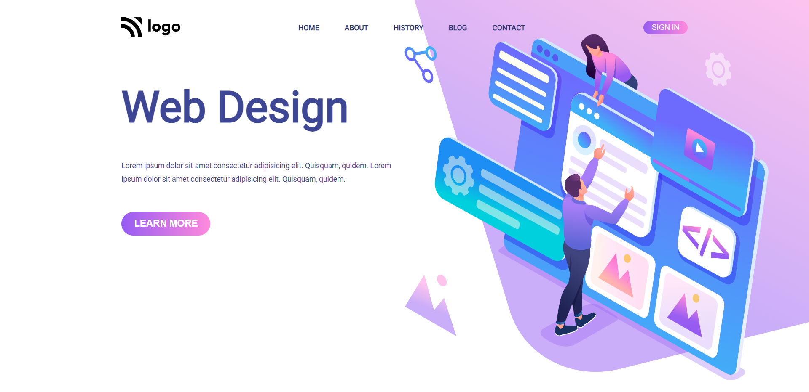

# Hey Welcome Buddy 👋

This is Rohit Madeshiya. Passionate to become a Full Stack Developer.

## Project Name : **Web Design Landing Page !**

In this project i have created a Web Design landing page from scratch. And i have learnt a lot of things like how to use flex and how css makes life easier , we can manipulate the things in Html with the help of CSS without touching HTML file in terms of positing and direction not in terms of DOM manipulation😅.

 

# 💻 Tech Stack Used :

 

 

### My Project is looking like :

### You can Check it Live on Below Link :

[Live Link !](https://web-design-landing-page.netlify.app/)
